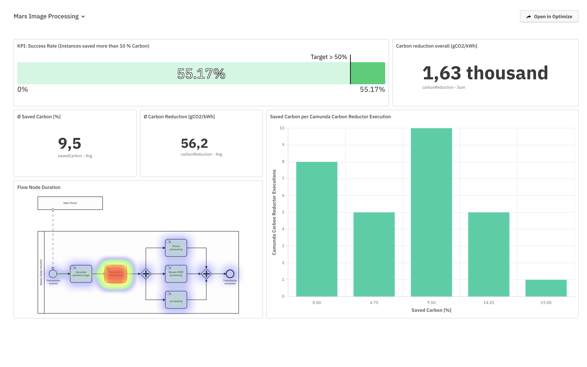

# 🌱Camunda Carbon Reductor

The Camunda Carbon Reductor allows you to time shift your processes' carbon emissions when energy is clean while still fulfilling the requested SLAs.

Technically, it's implemented as a Camunda [Connector](https://docs.camunda.io/docs/components/connectors/introduction-to-connectors/) for Camunda Platform 8 and as an [External Task Worker](https://docs.camunda.org/manual/latest/user-guide/process-engine/external-tasks/) for Camunda Platform 7.

---

You want to contribute 🌱? Please read the [Contribution Guidelines](CONTRIBUTING.md).

# Table of Contents

* ✨ [Features](#features)
  * [Time Shifting Mode ⏭️](#time-shifting-mode-)
  * [Measuring Mode 📏](#measuring-mode-)
* 🚀 [Getting Started](#getting-started)
  * [Camunda 8](#camunda-8)
  * [Camunda 7](#camunda-7)
* 📈 [Reporting Carbon Reduction via Camunda Optimize](#reporting-carbon-reduction-via-camunda-optimize)
* 📚 [Releases](#releases)
* 📆 [Publications](#publications)
* 📨 [Contact](#contact)

# ✨Features

The Carbon Reductor Connector consists of an element-template that can be used in the process
model that connects to the connector function.

## Time Shifting Mode ⏭️

Using the time shifting mode (default) the Carbon Reductor Connector allows you to
optimize for lower carbon emissions by moving your process execution into a timeframe with the least amount 
of carbon possible while still fulfilling SLAs.

The Carbon Reductor Connector defines the following inputs:

- the location where the worker are running (e.g. Germany, UK, France, USA, etc.)
- a milestone (a timestamp used to calculate the duration the process instance has been running)
- a duration for the remainder of the process (the duration the remainder needs at most)
- the maximum duration a process instance can take

## Measuring Mode 📏

> *Note*: This mode only works with the [Carbon Aware SDK](./api-carbon-aware/README.md) API at the moment.

Using the measuring mode the Carbon Reductor Connector allows you to measure the emissions in gCO2e/KWh at 
execution time and reports as well the emissions at the optimal time while still fulfilling your SLAs.

The same input as in the [Time Shifting Mode ⏭️](#time-shifting-mode-) is required.

# 🚀Getting Started

We provide the Carbon Reductor for Camunda Platform 7 and 8:

## Camunda 8

To start the Camunda 8 Connector have a look at the specific [README](./camunda-carbon-reductor-c8/README.md).

## Camunda 7

To start the Camunda 7 External Task Worker have a look at the specific [README](./camunda-carbon-reductor-c7/README.md).

# 📈Reporting Carbon Reduction via Camunda Optimize

Since Camunda Carbon Reductor stores the carbon savings as process variables, 
we have the ability to visualize our successes in [Camunda Optimize](https://camunda.com/de/platform/optimize/).

For the [CarbonHack22](https://taikai.network/gsf/hackathons/carbonhack22/projects/cl9czuvwy65500401uzm9hfwbs9/idea) 
we visualized the results for out example process and it looks like the following: 

The exported Dashboard Definition could be found [here](assets/optimize-dashboard-definition.json).

# 📚Releases

The list of [releases](https://github.com/envite-consulting/camunda-carbon-reductor/releases) contains a detailed changelog.

We use [Semantic Versioning](https://semver.org/).

The following compatibility matrix shows the officially supported Camunda versions for each release.
Other combinations might also work but have not been tested.

| Release | Camunda Platform 8 | Camunda Platform 7 |
|---------|--------------------|--------------------|
| 2.0.1   | 8.2.3              | 7.19.0             |
| 2.0.2   | 8.2.3              | 7.19.0             |

Click to see older releases

| Release | Camunda Platform 8 | Camunda Platform 7 |
|---------|--------------------|--------------------|
| 1.0.0   | 8.1.0              | 7.18.0             |
| 1.1.0   | 8.2.0              | 7.19.0             |
| 2.0.0   | 8.2.3              | 7.19.0             |
| 2.0.1   | 8.2.3              | 7.19.0             |
| 2.0.2   | 8.2.3              | 7.19.0             |

Download of Releases:
* [GitHub Artifacts](https://github.com/envite-consulting/camunda-carbon-reductor/releases)

# 📆Publications

* 2023-09: [Camunda Marketplace](https://marketplace.camunda.com/en-US/apps/419555/carbon-reductor)
* 2023-07: [The Camunda 8 Connector for Carbon-Aware Process Execution](https://bit.ly/3NZ5LMz)
* 2023-02: Hehnle, Philipp; Behrendt, Maximilian; Weinbrecht, Luc (20.2023): Digitale Geschäftsprozesse klimabewusst ausführen. In: Uwe Friedrichsen (Hg.): IT Spektrum. Green IT, S. 16–19.
* 2022-11: [Carbon Reduced Business Process Execution](https://youtu.be/sGW5MJoOxPk)  
  2 Minute pitch on YouTube as part of the [#CarbonHack22](https://greensoftware.foundation/articles/carbonhack22) hackathon
* 2022-11: [Project Pitch](https://taikai.network/gsf/hackathons/carbonhack22/projects/cl9czuvwy65500401uzm9hfwbs9/idea)  
  Project pitch on Taikai as part of the [#CarbonHack22](https://greensoftware.foundation/articles/carbonhack22) hackathon

If you are interested in our work and want to get to know more, feel free to reach out to us.

# 📨Contact

If you have any questions or ideas feel free to create an [issue](https://github.com/envite-consulting/carbonaware-process-automation/discussions/issues) or contact us via GitHub Discussions or [mail](mailto:carbon-reductor@envite.de).

This open source project is being developed by [envite consulting GmbH](https://envite.de).

