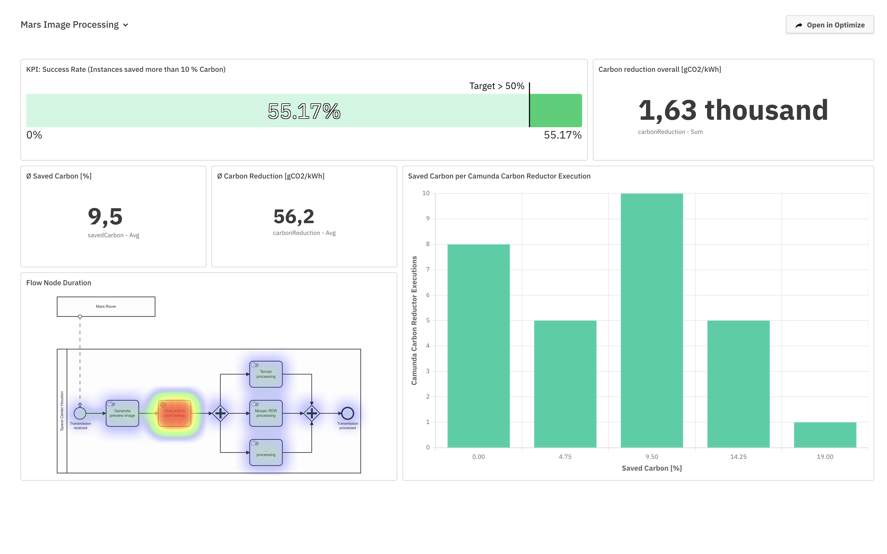

# 🌱Camunda Carbon Reductor

The Camunda Carbon Reductor allows you to time shift your processes' carbon emissions when energy is clean while still fulfilling the requested SLAs.

Technically, it's implemented as a Camunda [Connector](https://docs.camunda.io/docs/components/connectors/introduction-to-connectors/) for Camunda Platform 8 (and can easily be ported to Camunda Platform 7).

# Table of Contents

* ✨ [Features](#features)
* 🚀 [Getting Started](#getting-started)
  * [Register to Camunda Platform 8 SaaS](#register-to-camunda-platform-8-saas)
  * [Create a cluster and client](#create-a-cluster-and-client)
  * [Import Process Model to Camunda Platform 8](#import-process-model-to-camunda-platform-8)
  * [Run Carbon Aware SDK Web API locally](#run-carbon-aware-sdk-web-api-locally)
  * [Run Connector](#run-connector-locally)
* 📈 [Reporting Carbon Reduction via Camunda Optimize](#reporting-carbon-reduction-via-camunda-optimize)
* 📚 [Releases](#releases)
* 📆 [Publications](#publications)
* 📨 [Contact](#contact)

# ✨Features

The Carbon Reductor Connector consists of an element-template that can be used in the process 
model that connects to the connector function. The Carbon Reductor Connector allows you to
optimize for lower carbon emissions by moving your process execution into a timeframe with the least amount 
of carbon possible while still fulfilling SLAs.

The Carbon Reductor Connector defines the following inputs:

- the location where the worker are running (e.g. Germany, UK, France, USA, etc.)
- a milestone (a timestamp used to calculate the duration the process instance has been running)
- a duration for the remainder of the process (the duration the remainder needs at most)
- the maximum duration a process instance can take

# 🚀Getting Started

## Register to Camunda Platform 8 SaaS

If you don't have a Camunda Platform 8 account you can create a 30-day trial: https://accounts.cloud.camunda.io/signup

## Create a Cluster and Client

* Login to Camunda Platform 8: https://camunda.io/
* Create a cluster
* Register a new client in the section "API". Select all scopes if unsure.

## Import Process Model to Camunda Platform 8

* Open the Camunda Web Modeler
* Import the process model `exampleprocess/NasaImageProcessing.bpmn`
* Start a new instance
* Switch to Camunda Operate to see the token waiting at the connector

## Run Carbon Aware SDK Web API locally

Start the carbon aware SDK locally which acts as a proxy to the WattTime-API:

1. Create Docker image:
```bash
git clone https://github.com/Green-Software-Foundation/carbon-aware-sdk.git
cd carbon-aware-sdk/src
docker build -t carbon-aware-sdk-webapi -f CarbonAware.WebApi/src/Dockerfile .
```

2. Run Docker image:

Note: Replace `<myWattTimeUsername>` and `<myWattTimePassword>` with your individual credentials in the following command.

```bash
docker run -it --rm -p 8090:80 \
    -e CarbonAwareVars__CarbonIntensityDataSource="WattTime" \
    -e WattTimeClient__Username="<myWattTimeUsername>" \
    -e WattTimeClient__Password="<myWattTimePassword>" \
  carbon-aware-sdk-webapi
```

Test the API with `curl -s "http://localhost:8090/emissions/forecasts/current?location=westus2"`.
This should return a lengthy JSON response.

Congratulations 🎉 - the API is now running locally.

## Run Connector locally

Configure the application using [application.yml](/src/main/resources/application.yml). 

You can run the Connector and connect it to a Camunda Platform 8 SaaS cluster.

```yml
zeebe:
  client:
    cloud:
      clientId: xxx
      clusterId: xxx
      clientSecret: xxx
      region: dsm-1
```

If you're running Camunda Platform 8 Self-Managed then use the following configuration:

```yml
zeebe:
  client:
    broker.gateway-address: 127.0.0.1:26500
    security.plaintext: true
```

Once the Connector is running you will see log entries like the following.

In case of a time window with dirty energy:
```
Time shifting job 4503599628706752 by PT1M30S
...
Completing previously time shifted job 4503599628706752
```

In case of a time window with clean energy:
```
Executing job 4503599628706759 immediately
```

# 📈Reporting Carbon Reduction via Camunda Optimize

Since Camunda Carbon Reductor stores the carbon savings as process variables, 
we have the ability to visualize our successes in [Camunda Optimize](https://camunda.com/de/platform/optimize/).

For the [CarbonHack22](https://taikai.network/gsf/hackathons/carbonhack22/projects/cl9czuvwy65500401uzm9hfwbs9/idea) 
we visualized the results for out example process and it looks like the following: [CarbonHack22 Dashboard](https://dsm-1.optimize.camunda.io/9f797e79-5066-47cc-bc67-cc7d0f22f96c/external/#/share/dashboard/0dae7a0c-decd-407f-b643-a00a31e1949b?filter=%5B%5D)



# 📚Releases

Coming soon 🚀

# 📆Publications

* 2022-11: [Project Pitch](https://taikai.network/gsf/hackathons/carbonhack22/projects/cl9czuvwy65500401uzm9hfwbs9/idea)  
  Project pitch on Taikai as part of the [#CarbonHack22](https://greensoftware.foundation/articles/carbonhack22) hackathon
* 2022-11: [Carbon Reduced Business Process Execution](https://youtu.be/sGW5MJoOxPk)  
  2 Minute pitch on YouTube as part of the [#CarbonHack22](https://greensoftware.foundation/articles/carbonhack22) hackathon

# 📨Contact

If you have any questions or ideas feel free to create an [issue](https://github.com/envite-consulting/carbonaware-process-automation/discussions/issues) or contact us via GitHub Discussions or mail.

This open source project is being developed by [envite consulting GmbH](https://envite.de).


