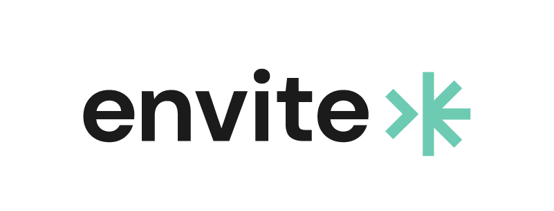

# 🌱⏲ Green Timer Task Connector

The Carbon Reductor Connector allows you to optimize your carbon emissions running your processes in a 
specific timeframe by not breaking the defined SLAs.

# Table of Contents

* ✨ [Features](#features)
* 🚀 [Getting Started](#getting-started)
  * [Run Carbon Aware SDK Web API locally](#run-carbon-aware-sdk-web-api-locally)
  * [Run Connector locally](#run-connector-locally)
* 📚 [Releases](#releases)
* 📆 [Publications](#publications)
* 📨 [Contact](#contact)

# ✨Features

The Carbon Reductor Connector consists on the one hand of an element-template that can be used in the process 
model that connects to the connector function on the other hand. The Carbon Reductor Connector allows you to
optimize for lower carbon emissions by moving your process execution into a timeframe with the least amount 
of carbon possible.

The Carbon Reductor Connector defines the following inputs:

- a correlation key (used to calculate the duration the process instance has been running)
- a duration for the remainder of the process (the duration the remainder needs at most)
- the location where the worker are running (e.g. Germany, UK, France, USA, etc.)
- the maximum duration a process instance can take

# 🚀Getting Started

## Run Carbon Aware SDK Web API locally

Start the carbon aware SDK locally which acts as a proxy to the WattTime-API:

1. Create Docker image:
```bash
git clone https://github.com/Green-Software-Foundation/carbon-aware-sdk.git
cd src
docker build -t carbon-aware-sdk-webapi -f CarbonAware.WebApi/src/Dockerfile .
```

2. Run Docker image:  

Note: Replace `wattTimeUsername` and `wattTimePassword` with your individual credentials in the following command.

```bash
docker run -it --rm -p 8090:80 \
    -e CarbonAwareVars__CarbonIntensityDataSource="WattTime" \
    -e WattTimeClient__Username="<wattTimeUsername>" \
    -e WattTimeClient__Password="<wattTimePassword>" \
  carbon-aware-sdk-webapi
```

Test the API with `curl -s "http://localhost:8090/emissions/forecasts/current?location=westus2"`. 
This should return a lengthy JSON response.

Congratulations 🎉 - the API is now running locally.

## Run Connector locally.

Configure the application using [application.properties](/src/main/resources/application.properties). 
You can run the Connector locally connected either to a Camunda Cloud or local Camunda instance:

1. Camunda Cloud

```properties
zeebe.client.cloud.cluster-id=xxx
zeebe.client.cloud.client-id=xxx
zeebe.client.cloud.client-secret=xxx
zeebe.client.cloud.region=dsm-1
```

3. local Camunda Instance

```properties
zeebe.client.broker.gateway-address=127.0.0.1:26500
zeebe.client.security.plaintext=true
```

# 📚Releases

Coming soon 🚀

# 📆Publications

Coming soon

# 📨Contact

If you have any questions or ideas feel free to create an [issue](https://github.com/envite-consulting/carbonaware-process-automation/discussions/issues) or contact us via GitHub Discussions or mail.

This open source project is being developed by [envite consulting GmbH](https://envite.de).

