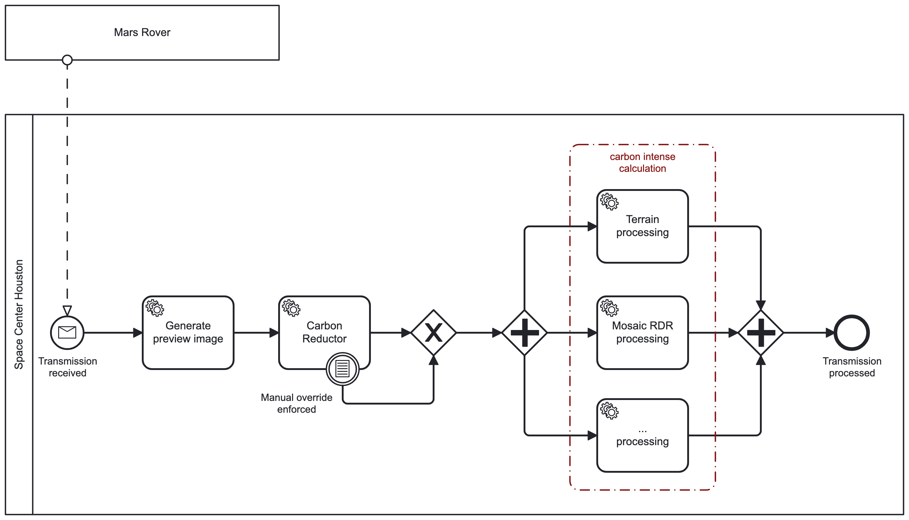

# 🌱Camunda Carbon Reductor - Camunda 7

Camunda 7 [External Task Worker](https://docs.camunda.org/manual/7.18/user-guide/process-engine/external-tasks/) adapter implementation of the Carbon Reductor.
Provides also a Service Task Template for configuration ([carbon-reductor.json](../exampleprocess/c7/.camunda/element-templates/carbon-reductor-c7-template.json))


* [🚀Getting Started](#getting-started)
  * [Choose the underlying API](#choose-the-underlying-api)
  * [Start Camunda Carbon Reductor](#start-camunda-carbon-reductor)
  * [Run the External Task Worker locally](#run-the-external-task-worker-locally)
  * [Building the Docker containers](#building-the-docker-containers)
  * [Adding the element template to the modeler](#adding-the-element-template-to-the-modeler)
  * [Configuring the element template](#configuring-the-element-template)
* [🖐🏼 Manual Override](#-manual-override)

# 🚀Getting Started

## Choose the underlying API

We support different APIs which could be used to fetch the forecast data.
Have a look at our [APIs](../api/README.md) to see which ones are supported yet.
You could turn the different adapters on and off via a configuration flag in the
[application.yml](./src/main/resources/application.yml).

## Start Camunda Carbon Reductor
Add the WattTime credentials in the
[docker-compose File](./docker-compose.yaml) and start the
docker container by running `docker-compose up`.

The docker-compose contains an example Camunda Platform 7 Engine.
You can start the example process manually via the Camunda [Tasklist](http://localhost:7777/camunda/app/tasklist/), login as user with **username** `admin` and **password** `pw`.

## Run the External Task Worker locally

Configure the application using [application.yml](./src/main/resources/application.yml).

You can run the External Task Worker and connect it to a Camunda Platform 7.

```yml
camunda.bpm:
  client:
    base-url: <base_url>
    async-response-timeout: <async_response_timeout>
    worker-id: <worker_id>

```

## Building the Docker containers

To build the containers locally, you simply need to build them via the
`docker-compose` file to keep the parent module scope:

```bash
# Build all containers
docker-compose build

# Build specific container 
docker-compose build <service-name; e.g. camunda-7-carbon-reductor-connector>
```

## Adding the element template to the modeler

Element templates are JSON files. To integrate them into Camunda 
Modeler you need to add them to the `resources/element-templates` 
directory of your Modeler. Have a look at the [Camunda Docs](https://docs.camunda.io/docs/components/modeler/desktop-modeler/element-templates/configuring-templates/#example-setup) for 
a detailed explanation.

The Camunda Carbon Reductor Camunda 7 can be downloaded from the 
release page or the newest version from [here](../exampleprocess/c7/.camunda/element-templates/carbon-reductor-c7-template.json).

## Configuring the element template

To configure the template task just open the properties panel and adjust the default values.  
All options should be self-explaining. If not, open a PR to improve the descriptions.

The OutMapping could be configured to your own needs. So feel free to rename the resulting variables.

# 🖐🏼 Manual Override

To manually override the postponement of the carbon reductor you could add a [conditional boundary event](https://docs.camunda.org/manual/latest/reference/bpmn20/events/conditional-events/) to 
it as shown in the following image. 


