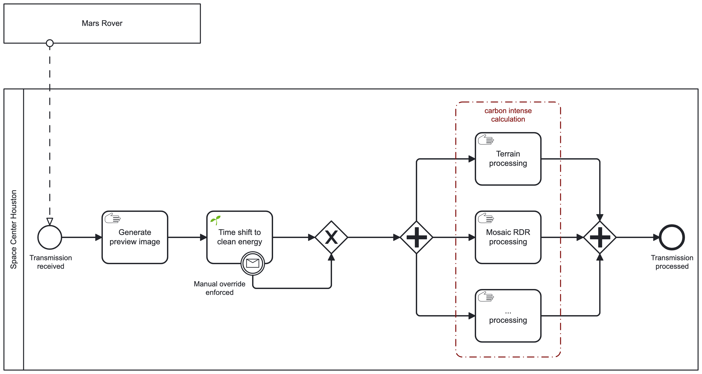
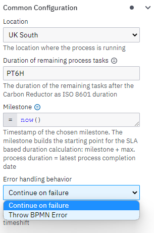
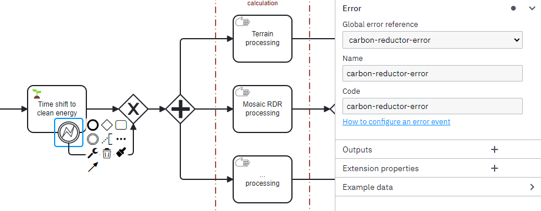
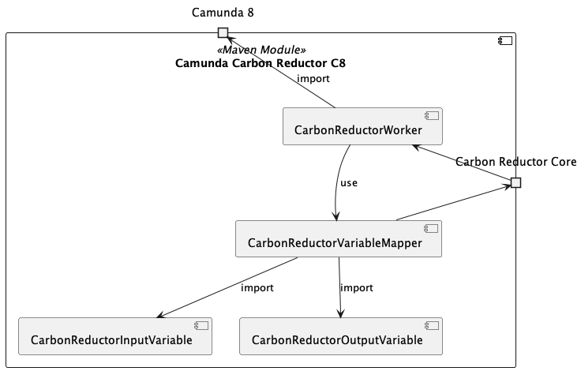

# 🌱Camunda Carbon Reductor - Camunda 8

Camunda 8 [Connector](https://docs.camunda.io/docs/components/connectors/introduction-to-connectors/) adapter 
implementation of the Carbon Redcutor.

# Table of Contents

* 🗒 [Notes](#notes)
* 🚀 [Getting Started](#getting-started)
  * [Create a cluster and client](#create-a-cluster-and-client)
  * [Import Process Model to Camunda Platform 8](#import-process-model-to-camunda-platform-8)
  * [Choose the underlying API](#choose-the-underlying-api)
  * [Run Connector locally](#run-connector-locally)
  * [Building the Docker containers](#building-the-docker-containers)
  * [Adding the element template to the modeler](#adding-the-element-template-to-the-modeler)
  * [Configuring the element template](#configuring-the-element-template)
* 🖐🏼[Manual Override](#-manual-override)
* 🏗️[Building Blocks](#building-blocks)

# 🗒️Notes

Right now it's kind of a job-worker-connector, due to the fact we need
to delay it with the `retryBackoff`.

`TODO`: Migrate to the "real" Camunda 8 [Connector](https://docs.camunda.io/docs/components/connectors/custom-built-connectors/connector-sdk/) if 
it provides the functionality to allow delaying the execution.

# 🚀Getting Started

Add the WattTime credentials as well as the Camunda SaaS one in the 
[docker-compose File](./docker-compose.yaml) and start the 
docker container by running `docker-compose up`.

## Create a Cluster and Client

* Login to Camunda Platform 8: https://camunda.io/
* Create a cluster
* Register a new client in the section "API". Select all scopes if unsure.

## Import Process Model to Camunda Platform 8

* Open the Camunda Web Modeler
* Import the process model [`exampleprocess/c8/NasaImageProcessing.bpmn`](../exampleprocess/c8/NasaImageProcessing.bpmn)   
  You need to [import the connector](https://docs.camunda.io/docs/components/connectors/manage-connector-templates/#importing-existing-connector-templates) as well as re-link it in the process model.  
  You can find the element template next to the process model: [`exampleprocess/c8/.camunda/element-templates/carbon-reductor-c8-connector.json`](../exampleprocess/c8/.camunda/element-templates/carbon-reductor-c8-connector.json)
* Start a new instance
* Switch to Camunda Operate to see the token waiting at the connector

## Choose the underlying API

We support different APIs which could be used to fetch the forecast data. 
Have a look at our [APIs](../api/README.md) to see which ones are supported yet. 
You could turn the different adapters on and off via a configuration flag in the
[application.yml](./src/main/resources/application.yml). But keep in mind to turn 
off the default API if you like to enable another one.

## Run Connector locally

Configure the application using [application.yml](./src/main/resources/application.yml). Find more info at [Configuring Camunda 8 Connection](https://github.com/camunda-community-hub/spring-zeebe?tab=readme-ov-file#configuring-camunda-8-connection)

You can run the Connector and connect it to a Camunda Platform 8 SaaS cluster.

```yml
camunda:
  client:
    auth:
      client-id: xxx
      client-secret: xxx
    cluster-id: xxx
    region: xxx
    mode: saas
```

If you're running Camunda Platform 8 Self-Managed then use the following configuration:

```yml
camunda:
  client:
    zeebe:
      base-url: http://127.0.0.1:26500
```

Once the Connector is running you will see log entries like the following.

In case of a time window with dirty energy:
```
Time shifting job 4503599628706752 by PT1M30S
...
Completing previously time shifted job 4503599628706752
```

In case of a time window with clean energy:
```
Executing job 4503599628706759 immediately
```

## Building the Docker containers

To build the containers locally, you simply need to build them via the
`docker-compose` file to keep the parent module scope:

```bash
# Build all containers
docker-compose build

# Build specific container 
docker-compose build <service-name; e.g. camunda-8-carbon-reductor-connector>
```

## Adding the element template to the modeler

Element templates are JSON files. To integrate them into Camunda
Modeler you need to add them to the `resources/element-templates`
directory of your Modeler. Have a look at the [Camunda Docs](https://docs.camunda.io/docs/components/modeler/desktop-modeler/element-templates/configuring-templates/#example-setup) for
a detailed explanation.

The Camunda Carbon Reductor Camunda 8 can be downloaded from the
release page or the newest version from [here](../exampleprocess/c8/.camunda/element-templates/carbon-reductor-c8-connector.json).

## Configuring the element template

To configure the template task just open the properties panel and adjust the default values.  
All options should be self-explaining. If not, open a PR to improve the descriptions.

The OutMapping could be configured to your own needs. So feel free to rename the resulting variables.

# 🖐🏼 Manual Override

To manually override the postponement of the carbon reductor you could add a [conditional boundary event (interrupting)](https://docs.camunda.org/manual/latest/reference/bpmn20/events/conditional-events/) to
it. Due to the fact that the conditional boundary event is not supported yet, you need to fall back to a 
[message boundary event (interrupting)](https://docs.camunda.org/manual/latest/reference/bpmn20/events/message-events/) as shown in the following image.



# Error Handling

The error handling behavior of the carbon reductor can be configured in the element-template.
On Exceptions the process execution can either continue (the default) without timeshifting
or a BPMN Error can be thrown in order to handle the error in the process.



There are 2 options:
* Continue on failure (default)
  * On Exceptions the process continues without an error or incident. The execution won't be timeshifted.
* Throw BPMN Error
  * On Exceptions a BPMN Error will be thrown that can be caught in the process model.
  * The process model needs to catch the thrown BPMN Error with the name **carbon-reductor-error**



# 🏗Building Blocks



| Element                      | Description                                                                 |
|------------------------------|-----------------------------------------------------------------------------|
| CarbonReductorWorker         | `JobWorker` which connects to the model element and does the time shifting. |
| CarbonReductorVariableMapper | Maps the process data to the internal configuration model.                  |
| CarbonReductorInputVariable  | Object representing the input data from the process.                        |
| CarbonReductorOutVariable    | Object representing the data which is written back to the process.          |
