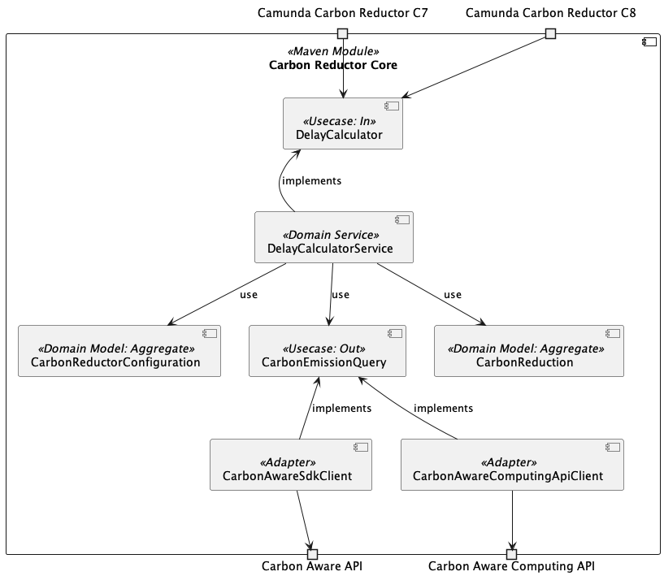

# 🌱Camunda Carbon Reductor - Core

Core of the Carbon Reductor, providing a single input use case which calculates delay. 

Uses the [Carbon Aware API](../api/api-carbon-aware/README.md).

# Table of Contents

* 🔧[️Configuration](#configuration)
* 🏗[️Building Blocks](#building-blocks)

# 🔧️Configuration

The environmental variable `CARBON-REDUCTOR_CARBON-AWARE-API_BASE-PATH` allows you to set the URL of the Carbon Aware API.  
Default is `http://localhost:8090`.

Or you can override all properties in the [application.yaml](./src/main/resources/application.yaml) by applying e.g. a custom one. 

# 🏗Building Blocks

| Element                      | Description                                                                 |
|------------------------------|-----------------------------------------------------------------------------|
| CarbonReductorWorker         | `JobWorker` which connects to the model element and does the time shifting. |
| CarbonReductorVariableMapper | Maps the process data to the internal configuration model.                  |
| CarbonReductorInputVariable  | Object representing the input data from the process.                        |
| CarbonReductorOutVariable    | Object representing the data which is written back to the process.          |
